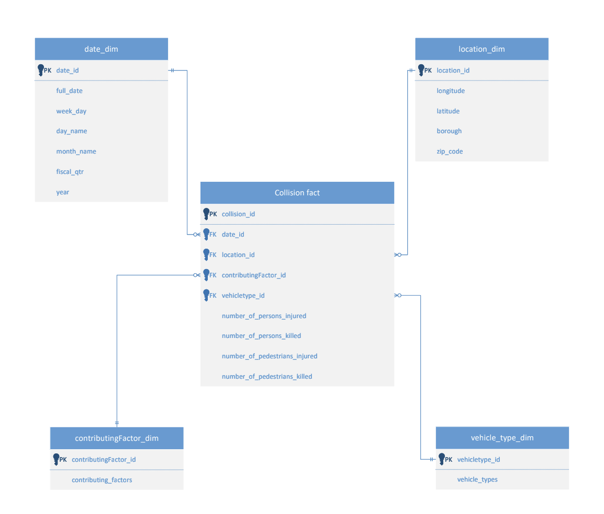
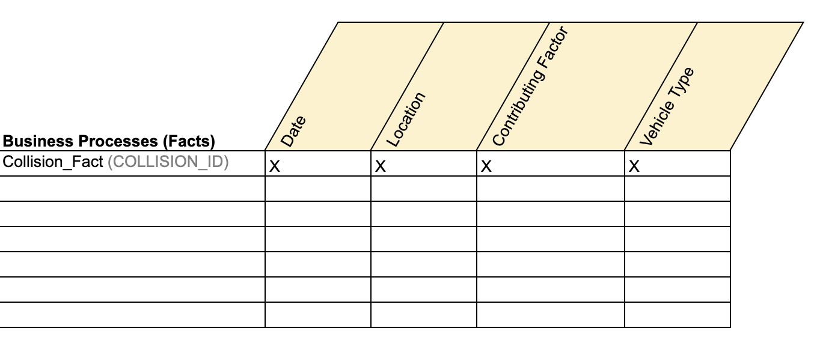

# Project Name: Data Warehousing for NYC Collisions
author(s): Sofia Shur, Raidah Moin, Eunjin Jung, Xiaozhong Li 
date created: 5/7/2022 
class: CIS 9440 

**Project Objective:** To follow the Kimball Lifecycle for designing and developing a public, cloud-based Data Warehouse with a functioning BI Applications.

**Project Tools:**

The tools used to build this Data Warehouse were:

For data integration - python
For data warehousing - Google BigQuery
For Business Intelligence - Tableau
Lucid website - Wireframes
Visio - Dimensional Model

## Kimball Lifecycle Project Stages

### Project Planning

***Motivation for project:***
To identify areas with the highest rate of car collisions and causes to help reduce it and save more lives.

***Description of the issues or opportunities the project will address:***
5 out of 100 accidents that take place in America, are based in New York. Although most accidents take place due to the negligence of the driver, there are other factors such as defects in a vehicle, confusing road designs and improper road conditions that also play a role in day to day car accidents. To ensure safer driving, NYC Car Collisions Data Warehouse aims to collect and analyze data based on these factors to uncover insights and provide actionable recommendations regarding the improvement of roads and driver behavior.

***Project Business or Organization Value:***
After figuring out factors that cause car accidents in NYC, NYPD and DOT can recommend strategies to New York State Legislators to reduce a rate of car collisions. In addition, they could also recommend strategies to raise public awareness of traffic safety.
For example, in NYC, for the first red light conviction, a driver will pay a minimum fine of $190. Increasing the fine could be a way to remind drivers of the significance of safe driving. 

***Data Sources:***

Motor Vehicle Collisions Crashes in NYC : https://data.cityofnewyork.us/Public-Safety/Motor-Vehicle-Collisions-Crashes/h9gi-nx95

### Business Requirements Definition

NYC Car Collisions - Data Warehouse KPI's:
1. Car collisions per borough
2. Car collisions per month
3. Injured people to the total crashes per month
4. Contributing factors per total accidents
5. Injured pedestrians and cyclists per car accidents
6. Mortality rate of car crashes per month

### Dimensional Model

This project's Dimensional Model consists of one table of Facts and 4 tables of Dimensions.

Dimensional model: 
****

This project's Kimball Bus Matrix: 
**** 

### ETL Design and Development
Built data pipeline using Python on Jupyter Notebook: https://github.com/lixiaozhong89/Data-Warehousing-for-NYC-Collisions/blob/51823d8803f6479fceab9500d47e5d15a5ccf688/ETL.ipynb
 
### Business Intelligence Design and Development

List of Visualizations for each KPI:
1. Bar Chart that shows the distribution and comparison of data points and values across different groups. 

2. Line graph to show the timeline (flow) of accidents.

3. Highlight table that can help understand the volume of an event / category. 

4. Stacked bar chart to show the total crashes and number of people injured

5. Dual-line chart to show the relationship between two variables. 

6. Table that shows the ratio of death per crash by month.
   

### Deployment

BI application was deployed on Tableau Public: https://public.tableau.com/app/profile/xiaozhong.li1583/viz/CIS9440vis/Story1
